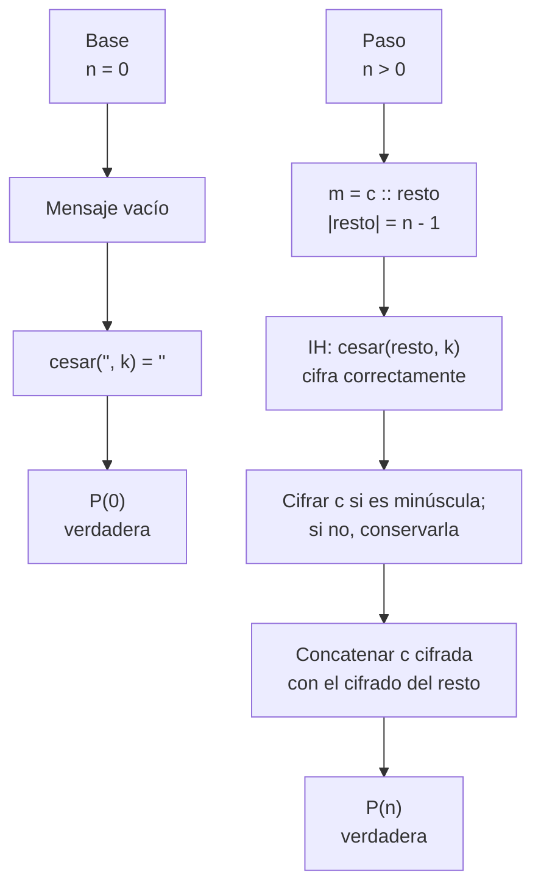
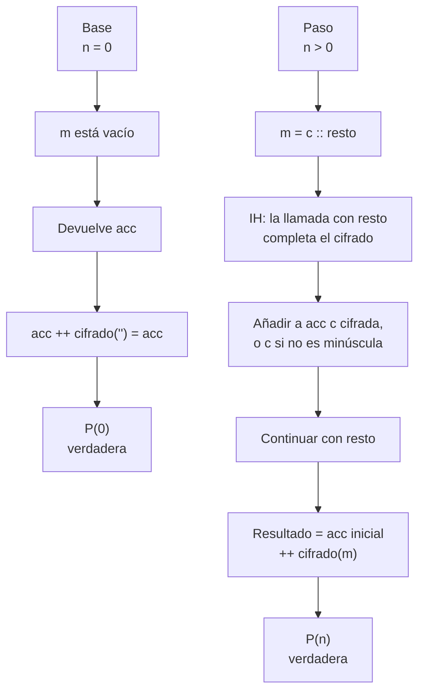
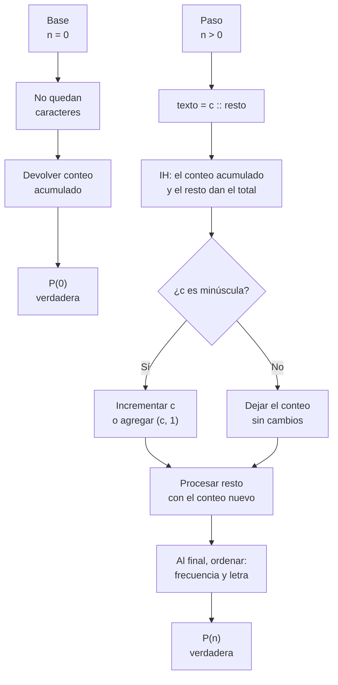
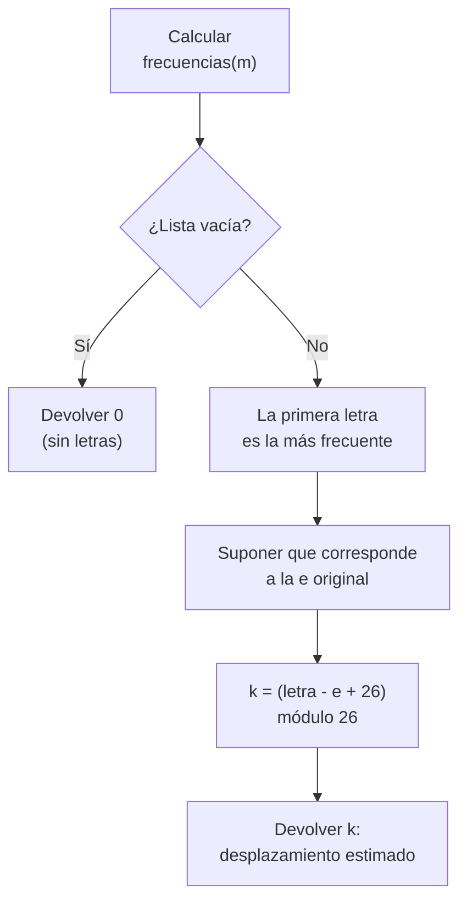
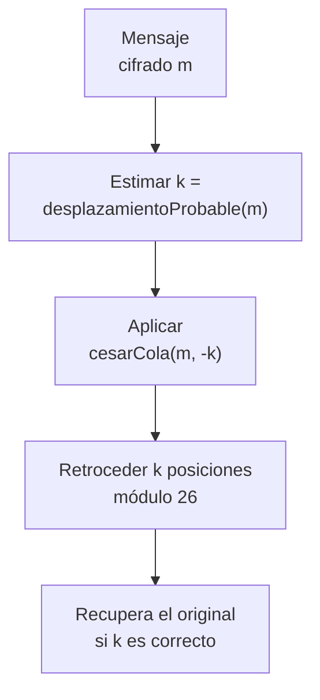
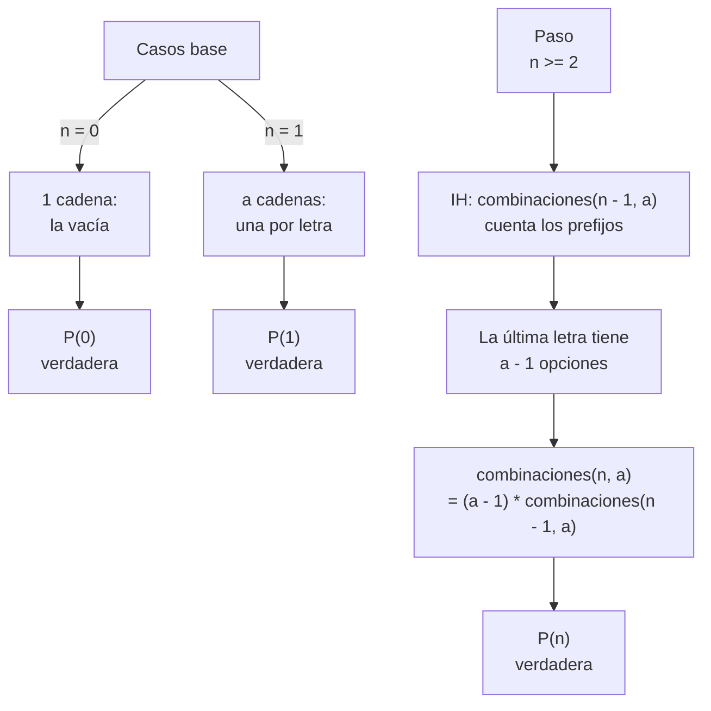
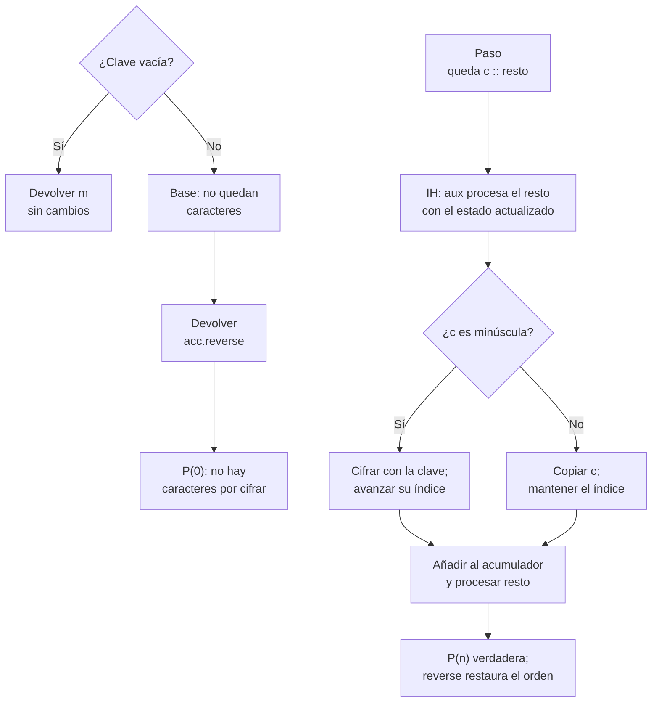

# Taller 1 — Cifrados clásicos con recursión

Fundamentos de Programación Funcional y Concurrente
Escuela de Ingeniería de Sistemas y Computación, Universidad del Valle
Carlos Andrés Delgado Saavedra

El enunciado completo, con los ejemplos de cada punto, la rúbrica y la
ecuación de calificación, es el PDF publicado en el campus virtual. Este
archivo dice cómo está armado el proyecto y cómo se entrega.

## Integrantes

Llene esta tabla con el nombre completo y el código de cada integrante. Es
parte de la entrega: si falta alguno, la entrega se sanciona con el 20 % de
la nota.

| Nombre completo | Código |
|---|---|
|Jose Emanuel Cuervo Buitrago|2559905-3743|
|Sergio Alejandro Quintero Bolivar|2559869-3743|
|Jhon David Ceballos Yate|2559724-3743|
| | |

## Cómo está organizado el proyecto

```
app/src/main/scala/taller/
    CifradosClasicos.scala    aquí van los cinco puntos
    App.scala                 programa de arranque

app/src/test/scala/taller/
    CifradosClasicosTest.scala   las 36 pruebas, que no se modifican

docs/                         los informes, en Markdown
```

Su código va en `main`. Las pruebas viven aparte y usted no las toca. Los
informes de proceso y de corrección que pide el enunciado van en `docs/`,
en Markdown, con la notación matemática en LaTeX y los diagramas en
`mermaid`; no se aceptan imágenes insertadas ni archivos por fuera de esa
carpeta.

## Cómo se ejecuta

```bash
./gradlew test    # revisa las reglas del curso y corre las pruebas
./gradlew run     # corre el programa
```

La primera vez se demora: Gradle descarga el compilador de Scala y la
versión de Java que necesita. No hay que instalar nada a mano. Al terminar,
`./gradlew test` deja un informe navegable en
`app/build/reports/tests/test/index.html`.

## El punto de partida

Al clonar, las 36 pruebas están en rojo, porque las siete funciones dicen
`???`. Ese es el estado esperado. Su trabajo es reemplazar cada `???` y ver
las pruebas ponerse en verde.

Los tipos `Mensaje`, `Clave` y `Frecuencias`, las constantes `letras` y
`primera`, y la función `esMinuscula` ya vienen escritos. Todo lo demás lo
escribe usted, dentro de `CifradosClasicos.scala`.

## Los cinco puntos

| Punto | Función | Recursión |
|---|---|---|
| 1 | `cesar(m: Mensaje, k: Int): Mensaje` | lineal |
| 2 | `cesarCola(m: Mensaje, k: Int, acc: Mensaje = ""): Mensaje` | de cola, con `@tailrec` |
| 3 | `frecuencias(m: Mensaje): Frecuencias` | de cola |
| 4 | `desplazamientoProbable(m: Mensaje): Int` y `romperCesar(m: Mensaje): Mensaje` | |
| 5 | `combinaciones(n: Int, a: Int): BigInt` y `vigenere(m: Mensaje, clave: Clave): Mensaje` | |

## Diagramas de inducción matemática

En los diagramas, `P(n)` denota la propiedad que se quiere demostrar y `IH`
la hipótesis inductiva. Para los métodos que no son recursivos se muestra su
argumento de corrección directa; su comportamiento depende de las condiciones
indicadas.

### Punto 1: `cesar`

Sea `P(n)` que cifrar un mensaje de longitud `n` produce, en cada posición, la
letra desplazada módulo 26 (y conserva los demás caracteres).



### Punto 2: `cesarCola`

Sea `P(n)` que, para cualquier acumulador `acc`, el resultado es `acc`
seguido del cifrado César del mensaje restante.



### Punto 3: `frecuencias`

Sea `P(n)` que, tras leer `n` caracteres, el conteo contiene exactamente las
letras minúsculas procesadas con sus cantidades. Al terminar, ordenar la lista
no cambia esos conteos y la deja de mayor a menor frecuencia y alfabéticamente
en caso de empate.



### Punto 4: `desplazamientoProbable`

Esta función no es recursiva, por lo que se justifica directamente. La
estimación es correcta bajo la suposición de que la letra cifrada más frecuente
corresponde a la `e` del mensaje original.



### Punto 4: `romperCesar`

Esta función tampoco es recursiva: compone la estimación anterior con el César
iterativo. La recuperación es correcta si la estimación del desplazamiento es
correcta.



### Punto 5: `combinaciones`

Sea `P(n)` que el resultado cuenta las cadenas de longitud `n` formadas con
`a` letras sin dos iguales consecutivas, para `n >= 0` y `a >= 1`.



### Punto 5: `vigenere`

Si la clave está vacía, la función devuelve el mensaje sin cambios. Con clave
no vacía, sea `P(n)` que `aux` transforma correctamente los primeros `n`
caracteres procesados: las minúsculas consumen una posición de clave y los
demás caracteres se copian sin consumirla.



En el punto 2, agregue la anotación `@tailrec` cuando la función esté
escrita: el compilador comprueba que la llamada recursiva sea lo último que
hace, y rechaza el programa si no lo es.

## Reglas del código

En este curso no se usa `var`, ni `while`, ni `return`, ni ningún estado que
cambie. Todo se resuelve con `val`, recursión y llamados a funciones. Si
necesita una secuencia de instrucciones, use un bloque `{ ... }`; si necesita
funciones auxiliares, escríbalas dentro de las funciones.

`./gradlew test` revisa estas reglas **antes** de correr las pruebas. Un
programa con `var`, `while` o `return` no llega a las pruebas: el flujo se
detiene y dice en qué línea está el problema.

No se editan los archivos de configuración del proyecto ni los flujos de
GitHub.

## Cómo se entrega

1. Presione **Fork** en este repositorio. Un solo integrante hace el fork y
   agrega a los demás como colaboradores; todo el equipo trabaja sobre ese
   mismo fork.
2. En su fork, entre a la pestaña **Actions** y habilítelas. GitHub las deja
   apagadas en los forks hasta que el dueño lo autoriza, y sin eso no ve el
   resultado de las pruebas al hacer push.
3. Clone su fork, resuelva, y haga commit y push a `main`. Cada integrante
   hace sus propios commits: la rúbrica de aporte al código se calcula con
   ellos.
4. Registre en la tarea **Entrega del taller 1** del campus virtual la
   dirección de su fork y el hash del último commit, que se obtiene con
   `git rev-parse HEAD`.

**La fecha de entrega es el jueves 8 de octubre de 2026, a las 23:59.**

Las condiciones son estas, y son las del acta de inicio del curso:

- **La entrega es el enlace registrado en el campus dentro del plazo.** No se
  aceptan entregas por correo ni por ningún otro medio. Si el enlace no llega
  a tiempo, la entrega se califica con **0.0**.
- **El repositorio tiene que ser un fork de este.** Un repositorio creado
  aparte, aunque tenga el mismo código, se sanciona con el **30 %** de la
  nota: rompe la estructura con que se califica y la verificación automática.
- **Se califica el último commit anterior a la fecha de entrega.** Lo que se
  suba después no se revisa. El hash que se registra en el campus debe ser el
  de ese commit.
- **El `README.md` lleva el nombre y el código de todos los integrantes.**
  Si falta alguno, la entrega se sanciona con el **20 %** de la nota.
- Se puede trabajar en grupos de hasta cuatro personas.
- El docente puede pedir sustentación del taller. En ese caso la nota de la
  sustentación es individual, entre 0 y 1, y multiplica la nota del taller.
