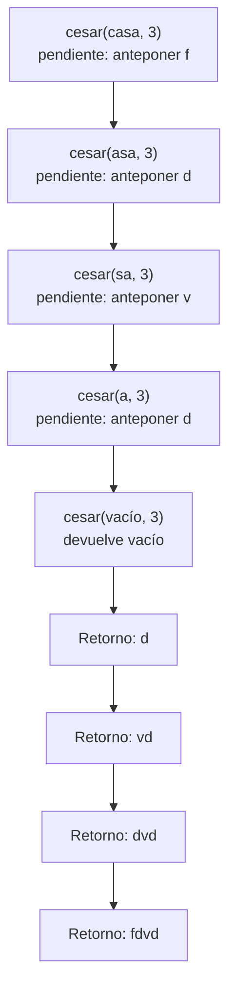
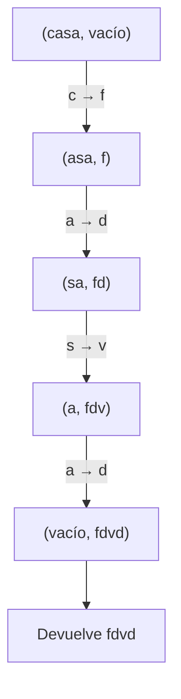

# Informe de proceso

## Propósito

Se sigue la ejecución de `cesar("casa", 3)` y `cesarCola("casa", 3)` para
comparar la recursión lineal con la recursión de cola. El desplazamiento 3
convierte `a` en `d`, `c` en `f` y `s` en `v`; por tanto, el resultado de
ambas funciones es `fdvd`.

## `cesar("casa", 3)`: recursión lineal

La función cifra la primera letra y concatena ese resultado después de que
termine la llamada recursiva. Por eso cada llamada debe esperar el resultado
del resto del mensaje.

### Descenso: llamadas pendientes

| Llamada | Carácter cifrado | Operación que queda pendiente |
|---|---|---|
| `cesar("casa", 3)` | `c` → `f` | anteponer `f` al resultado recursivo |
| `cesar("asa", 3)` | `a` → `d` | anteponer `d` al resultado recursivo |
| `cesar("sa", 3)` | `s` → `v` | anteponer `v` al resultado recursivo |
| `cesar("a", 3)` | `a` → `d` | anteponer `d` al resultado recursivo |
| `cesar("", 3)` | — | devolver `""` |

En este punto hay cuatro llamadas esperando en la pila. La evaluación retorna
deshaciendo esas llamadas:

```text
cesar("", 3)       = ""
cesar("a", 3)      = "d" + ""     = "d"
cesar("sa", 3)     = "v" + "d"    = "vd"
cesar("asa", 3)    = "d" + "vd"   = "dvd"
cesar("casa", 3)   = "f" + "dvd"  = "fdvd"
```



La profundidad máxima es proporcional a la longitud del mensaje: para un
mensaje de longitud $n$, se acumulan $n$ llamadas antes de empezar a retornar.

## `cesarCola("casa", 3)`: recursión de cola

`cesarCola` recibe un acumulador `acc`. Cada paso cifra el carácter actual,
lo añade al acumulador y llama a la función con el resto. La llamada recursiva
es la última operación; no queda concatenación pendiente al retornar.

| Estado `(mensaje restante, acc)` | Acción |
|---|---|
| `("casa", "")` | cifra `c` como `f`; pasa a `("asa", "f")` |
| `("asa", "f")` | cifra `a` como `d`; pasa a `("sa", "fd")` |
| `("sa", "fd")` | cifra `s` como `v`; pasa a `("a", "fdv")` |
| `("a", "fdv")` | cifra `a` como `d`; pasa a `("", "fdvd")` |
| `("", "fdvd")` | caso base: devuelve `"fdvd"` |



Los estados muestran la secuencia lógica de la recursión. Como cada llamada
termina directamente con la llamada siguiente y el método está anotado con
`@tailrec`, Scala puede compilarla como un ciclo: no necesita conservar una
pila de llamadas pendiente de desenrollar. El espacio de pila se mantiene
constante respecto a la longitud del mensaje; el acumulador contiene el
resultado parcial.

## Comparación

| Función | Qué ocurre antes de la llamada recursiva | Trabajo pendiente al retornar | Espacio de pila |
|---|---|---|---|
| `cesar` | Cifra el carácter actual | Concatenar ese carácter con el resultado | Proporcional a la longitud del mensaje |
| `cesarCola` | Cifra y agrega el carácter a `acc` | Ninguno; el caso base devuelve `acc` | Constante por recursión de cola |
